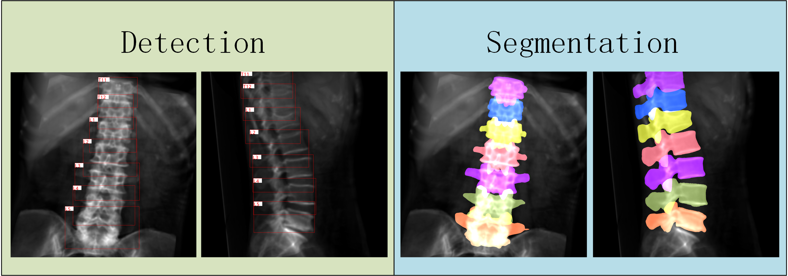

<!--
 * @Description: The README.md will be used to record thr process which conver the drr utils use cpp.
 * @version: 
 * @Author: ThreeStones1029 2320218115@qq.com
 * @Date: 2024-04-01 14:16:03
 * @LastEditors: ShuaiLei
 * @LastEditTime: 2024-06-21 14:45:07
-->
<h2 align="center">Deep Learning Spine DRR Toolkit Cpp</h2>
<p align="center">
    <a href="https://github.com/ThreeStones1029/drr_utils_cpp/blob/main/LICENSE">
        
    </a>
</p>




## Repository Notes
This repository used cpp to reproduce [drr_utils](https://github.com/ThreeStones1029/drr_utils)


## TODO
<details>
<summary> see details </summary>

- [*] main_drr_detection_dataset.cpp
- [*] main_drr_segmentation_dataset.cpp

</details>

## 

## Quick Start

<details>
<summary>Install</summary>

```bash
# install yaml-cpp
git clone https://github.com/jbeder/yaml-cpp.git
cd yaml-cpp && mkdir build && cd build
cmake ..
sudo make install

# install boolst
sudo apt-get install libboost-all-dev

# install matplotlibcpp
git clone https://github.com/lava/matplotlib-cpp.git
cd matplotlib-cpp && mkdir build && cd build
cmake ..
sudo make install
```
</details>

<details>
<summary>Run</summary>

```bash
cd build
cmake ..
make
# if regenerate from zero just ran the follow command
./main_drr_detection_dataset -r true 
# generating data from where you left off
./main_drr_detection_dataset
```

</details>
